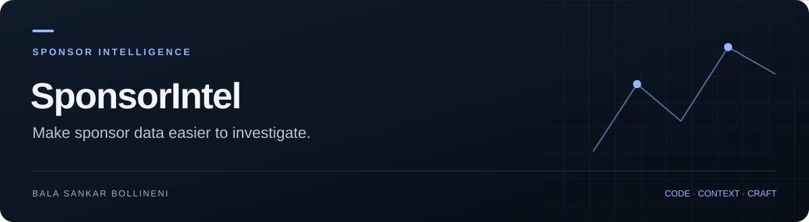

**[Project guide](docs/SHOWCASE.md)** · [Source](https://github.com/BalaShankar9/SponsorIntel) · [Issues](https://github.com/BalaShankar9/SponsorIntel/issues) · [Bala's work](https://github.com/BalaShankar9)

> **Current stage: Sponsor Intel × Hire Stack 2.3 beta.** [Open Sponsor Intel](https://sponsorintel.london) · [Immigration updates](https://sponsorintel.london/updates) · [Cloudflare fallback](https://sponsorintel.balashankarbollineni4.workers.dev). The integrated app lives in [`cloudflare/`](cloudflare/README.md). [Current release evidence](cloudflare/RELEASE-2.3.md) · [Build roadmap](docs/PRODUCT_ROADMAP.md) · [Community and search growth](docs/GROWTH_PLAN.md).

# SponsorIntel

A welcoming workspace for international students and people building a career in the UK: discover licensed employers, compare a shortlist, and track applications. The Cloudflare beta uses a dated official GOV.UK register and clearly separates a sponsor licence from an advertised job offering sponsorship.

## Current Cloudflare app

- Responsive React interface with employer search, city/route/rating filters and employer profiles.
- 127,902 employer/location records from the 2 October 2026 register at initial release; live counts and dates appear in the app.
- UK vacancies from configured public employer boards, with source dates and exact sponsorship wording.
- Hire Stack application workspace: master CV, evidence checks, editable CV and cover-letter drafts, interview preparation, stages and follow-up dates.
- PDF/DOCX/TXT/JSON Resume import; Word/PDF/text/calendar exports and workspace backups.
- Optional private accounts with cross-device career workspace sync and single-use recovery codes; guest mode remains available.
- Official immigration guidance checked every 15 minutes, source-version-pinned explanations, effective dates and a change history; private feedback.
- Visible site-wide feedback, bug reports and contextual data corrections, with private delivery and confirmation references.
- Eight readable public pages, practical sponsor-search guides, a share preview and canonical/sitemap controls.
- Cloudflare Worker, Workers AI, static assets and D1 with scheduled register and vacancy refreshes.

See [`cloudflare/README.md`](cloudflare/README.md) for setup, maintenance and rollback. The older services below remain in the repository for reference and staged migration. Their accounts, alerts, billing, scrapers and scoring are **not** connected to the beta.

## Legacy application quick start

### Prerequisites
- Docker & Docker Compose
- Make (optional)

### Setup

1. Clone and configure:
   ```bash
   cp .env.example .env
   # Edit .env with your settings
   ```

2. Start all services:
   ```bash
   make up
   # or: docker compose up -d
   ```

3. Seed the database:
   ```bash
   make seed
   # or: docker compose exec backend python -m app.scripts.seed_data
   ```

4. Open in browser:
   - Frontend: http://localhost:3000
   - API docs: http://localhost:8000/docs
   - Admin: admin@sponsorintel.com / admin123changeme

### Architecture

| Service | Port | Description |
|---------|------|-------------|
| Frontend | 3000 | Next.js React app |
| Backend | 8000 | FastAPI REST API |
| PostgreSQL | 5432 | Primary database |
| Redis | 6379 | Cache + Celery broker |
| Celery Worker | -- | Background scraping tasks |
| Celery Beat | -- | Scheduled task orchestrator |

### Key Commands

```bash
make up              # Start all services
make down            # Stop all services
make logs            # View logs
make migrate         # Run database migrations
make seed            # Import initial data
make test-backend    # Run backend tests
make test-frontend   # Run frontend tests
make shell           # Open Python shell
```

### Tech Stack

- **Backend:** Python 3.12, FastAPI, SQLAlchemy 2.0, Celery
- **Frontend:** Next.js 14, React 18, TypeScript, Tailwind CSS, Recharts
- **Database:** PostgreSQL 16 (pg_trgm for fuzzy search)
- **Cache:** Redis 7
- **Scraping:** httpx, Playwright, selectolax, curl_cffi
- **Deployment:** Docker, Nginx

### Features

- Sponsor company search over imported datasets
- 17 website scrapers (pure scraping, no API keys)
- 7-factor company scoring engine
- Real-time change detection and alerts
- Job intelligence with sponsorship likelihood NLP
- Interactive UK map
- Application tracker (Kanban)
- Freemium model (Free / Pro / Enterprise)
