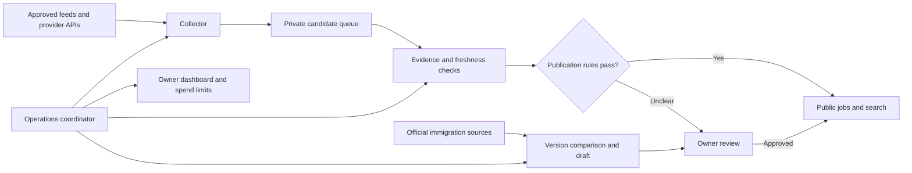

# Sponsor Intel: LinkedIn coverage and an agent operating team

Decision brief and implementation plan. Reviewed 7 October 2026.

## Recommendation

Pilot a provider that supplies LinkedIn-origin job records, while continuing to collect employer originals through the existing approved feeds. Start with a small, private quality sample and then publish only records whose use and quality have been checked. Build eight operational roles around the current Cloudflare service, using ordinary code for repeatable checks and AI for bounded research or drafting.

The product advantage should be accurate sponsorship evidence, current vacancies, useful application preparation and understandable guidance. Agent count and the number of copied jobs are not measures of quality.

## What already exists

The live Cloudflare app uses Workers, D1 and Workers AI. Its reviewed employer feeds run every six hours; the sponsor register is checked daily; selected official immigration sources are checked every 15 minutes. Source-run history, an owner review queue, feedback, account isolation and the Hire Stack workspace already provide much of the foundation.

The repository also contains `backend/app/agents/`, a LinkedIn browser scraper and older plans for a 181-agent system. Those depend on the legacy Python/Celery/Redis/Supabase services; they are not imported by the Cloudflare Worker entry point. The old documents' production/profitability/accuracy claims have not been independently revalidated. Reuse useful tests, source registries, retry patterns and concepts after review; do not restart that stack or treat its agent registry as evidence of live coverage. The legacy scraper uses browser/proxy access and does not establish permission to republish LinkedIn data.

## LinkedIn access: the practical route

LinkedIn's [open developer permissions](https://learn.microsoft.com/en-us/linkedin/shared/authentication/getting-access) cover identity and social actions. Its [Job Posting API](https://learn.microsoft.com/en-us/linkedin/talent/job-postings/api/create-jobs) manages vacancies posted to LinkedIn; it is not an open search/export API for every employer's jobs. A LinkedIn sign-in button does not unlock the job catalogue. Do not imply an official partnership without one.

Two supplier candidates were checked:

| Option | Published offer | Fit and unresolved questions |
|---|---|---|
| [Techmap / JobDataFeeds](https://jobdatafeeds.com/pricing) | Basic: 100 requests/month, up to 10 records/request. Pro: USD 29/month for 3,000 requests. Its pricing FAQ says public job-board display and storage for matching are permitted. | First pilot candidate. The API can filter LinkedIn origin and UK location. Subscription-specific permissions, UK coverage, deletion handling and actual freshness require evaluation. |
| [Fantastic.jobs](https://fantastic.jobs/) | Advertises LinkedIn-origin job data, hourly refresh and daily expiry checks; self-service starts at USD 95/month. | Alternative if coverage or confirmed closure handling is better. These are supplier claims, not measured results or proof of a LinkedIn agreement. Check the specific product's display/retention licence before subscribing. |

The [RapidAPI checkout listing](https://rapidapi.com/techmap-io-techmap-io-default/api/daily-international-job-postings/pricing) was inspected while signed out. It displayed Basic at USD 0/month with 100 requests and USD 0.06 per extra request; Pro at USD 29/month with 3,000 requests and USD 0.04 per extra request. It also displayed a platform bandwidth allowance and overage rate. No account, subscription, payment or authenticated API call was created. No complete subscription agreement has been accepted or verified.

Techmap's [website terms](https://jobdatafeeds.com/terms) explicitly distinguish website use from the separate API subscription agreement. Its [billing documentation](https://api.techmap.io/errors-and-billing) says quota overruns can be charged rather than stopped. Its FAQ says a payment card may be required for plans with overages. A free tier therefore needs a controlled request budget; marketing permission is not a substitute for checking the actual subscribed terms. A supplier API is not the same as LinkedIn approval.

### Pilot implementation prepared now

`cloudflare/integrations/techmap/pilot.js` implements one bounded JSON-page read against the documented provider endpoint, source normalisation and a shared SQL request reservation. `pilot-schema.sql` is a separate, unapplied pilot schema, not a production migration. Seven offline tests cover the main evidence and spending boundaries. Nothing in the production Worker imports, schedules or publishes from this module.

- Fixed provider host; the key is transmitted only in a request header. No LinkedIn cookies, credential forwarding, redirect following or proxy rotation.
- Explicit UK and LinkedIn filters, a seven-day query window and bounded pages/results. [The documented country mapping](https://api.techmap.io/jobs-api) accepts `gb` and normalises it to `uk`.
- Source links are reduced to their LinkedIn job ID for deduplication. Records retain provider, origin, received time, publication time and separately named expiry fields. Overseas, incomplete, duplicate and clearly expired records are rejected with reasons.
- Every accepted record remains `needs_review`, `public_display=false`, `availability=unverified` and without an employer licence link. Existing sponsorship wording rules can produce a quote, but do not establish eligibility or grant a licence match.
- The [field reference](https://api.techmap.io/field-reference) says `dateActive` can be an inferred expiry. It must not become a verified closing date, live employer check, or Google `validThrough` value. The original advert needs verification before publication.
- A single SQL budget row reserves each request atomically before sending it. Failed or uncertain requests remain counted. There is no automatic retry, rollover or counter reset. The prepared ceiling is 80 requests per explicitly configured billing period; begin with 10. Lower the ceiling if the subscription has already been used elsewhere. This caps this integration's calls, not unrelated calls made through the same subscription.

### Activation and evaluation steps

1. The owner signs into RapidAPI and reviews the exact Basic subscription agreement, any required payment details and overage terms. Save the permission/retention/attribution conditions in the provider record. Do not purchase Pro yet.
2. Store the API key as a server secret. Never paste it into a public page, source file, request URL or chat. Confirm the subscription's actual billing-period start/end and remaining allowance.
3. Provision the private pilot budget with a maximum of 10 requests and a dated approval reference. Bind the connector to an owner-only runner and a private candidate table; do not expose a public refresh or generic fetch endpoint.
4. Collect a target sample of 50 recent UK jobs across graduate, healthcare, hospitality, engineering and university searches, within those 10 calls. Empty or sparse results are a finding, not a reason to lift the budget automatically.
5. Review each original advert where access permits; use the employer's own advert/ATS feed where available. A blocked link, missing original or unclear rights stays pending. Record employing entity, sponsor identity, location, source dates, pay wording, sponsorship quotation and duplicates against our existing catalogue.
6. Compare against Fantastic.jobs only if the first provider fails the quality or coverage test and its own trial terms are acceptable. No supplier is a guarantee of complete LinkedIn coverage.
7. Add the public-feed adapter only after the rights/quality gate passes. Use the label **LinkedIn via Techmap**, alongside a direct employer source when present. Keep new unverified records private. Show unavailable/unknown status honestly and stop publishing a source on permission withdrawal.

Pilot success means traceable source records, no unsupported positive sponsorship labels in the audited sample, no known expired or overseas role accepted into the public set, and measured additional opportunities beyond the current feeds. Publish the sample size and errors; do not turn a small sample into a market-wide accuracy claim.

## The eight operating roles

| Role | Work and evidence produced | Automatic authority | Review boundary |
|---|---|---|---|
| Source scout | Find official careers feeds and candidate data suppliers; record ownership, access terms, sector and example jobs. | Search/read approved sources and draft source proposals. | New source enablement, subscription and new legal-entity alias. |
| Job collector | Fetch approved feeds, preserve provenance, normalise records and handle provider failures. | Refresh existing approved sources under quotas and rate limits. | Unknown schema, new destination or source permission change. |
| Sponsorship verifier | Link reviewed employer identities to the current register; extract exact advert wording and conflicts. | Apply deterministic reviewed links and conservative text rules. | Fuzzy names, contradictory wording or a new positive classifier rule. |
| Freshness and duplicate checker | Process explicit closure evidence, detect repeated jobs, quarantine stale records and retain the last complete snapshot after failure. | Exclude expired/stale records and merge exact known source IDs. | Probabilistic cross-employer merges or ambiguous closure. |
| Immigration editor | Watch official sources, compare versions and draft who/what/when explanations with source passages. | Detect changes and invalidate explanations tied to older text. | New explanations and effective-date interpretations need editorial review; personalised case advice goes to regulated advisers. |
| Application coach | Existing Hire Stack CV/JD evidence mapping, drafts, factual checks and interview preparation. | Run only for the requesting user's authorised workspace and AI consent. | The applicant reviews factual claims and submits applications themselves. |
| Growth editor | Find useful content gaps, check metadata/internal links and prepare source-backed guides and outreach drafts. | Read aggregate metrics and create drafts. | Public legal/immigration content, social posts, messages, paid campaigns and mass page generation. |
| Operations and support coordinator | Schedule tasks, inspect failures/costs, triage bug reports, prioritise work and assemble a concise owner dashboard. | Retry permitted jobs within budgets; pause failing sources; classify support tickets. | Code deployment, destructive actions, account privileges, financial commitments and external correspondence. |

The coordinator is a scheduler and policy enforcer, not an unrestricted master account. A language model may propose an action; server code checks capability, account scope, budget and task state before executing it. Source webpages and job descriptions are untrusted data, never instructions to agents.

## Cloudflare design

Keep the existing app and D1 data. Use [Workflows](https://developers.cloudflare.com/workflows/) for durable multi-step runs with checkpoints/retries. Introduce the [Agents SDK](https://developers.cloudflare.com/agents/) only where persistent interactive coordination is useful; ordinary feed parsing and database checks do not need an AI model. The SDK is not installed or running in the live app as part of this proposal.

Use one record per task with an idempotency key, type, input-source ID, source version, status, attempt count, timestamps, result reference and bounded error. Suggested states: `queued`, `running`, `needs_review`, `approved`, `published`, `failed`, `paused`. A job publication records the ruleset/version and evidence that passed. Retrying the same source version must not duplicate a job, email, charge or publication.

Use existing D1 for job/identity/workflow metadata. If licensed raw snapshots are retained, use private R2 objects with explicit retention/deletion dates. Queues can decouple source batches once volume or independent retries justify them; avoid adding them merely to give each role its own service. Use Workers secrets for external keys and bind them only to the collector. The growth/scout roles receive no CVs, account tokens or raw personal analytics.

The owner dashboard should show actual runs, not decorative agent avatars: current task, last success, next scheduled run, accepted/rejected records, unresolved reviews, failed sources, queue age, allowance remaining and pause/resume controls. Surface important failures and required decisions; do not manufacture activity updates.

## Delivery sequence and gates

**Phase 1 — LinkedIn-origin data pilot.** Complete the access steps above, add owner-only staged storage/run controls, audit 50 records and establish cost per additional usable UK opportunity. Keep it disconnected from public search until acceptance.

**Phase 2 — reliable sourcing operations.** Wrap the existing collector/verifier/freshness functions in durable, idempotent tasks. Introduce per-source pauses, retries, run receipts, budget enforcement and a private review inbox. Test interrupted execution, duplicated dispatch, expired register data, unavailable providers, quota exhaustion and resume. Observe real scheduled runs before calling the team operational.

**Phase 3 — immigration and application quality.** Add reviewed source-change explanations, version invalidation and effective-date evidence. Complete the existing 20 varied CV/JD benchmark and distinguish evidence from inference. Measure source freshness and factual error rates independently of model confidence.

**Phase 4 — growth and support.** Add draft content plans and support triage using real issues. Send alerts only to verified, opted-in recipients with unsubscribe controls and after delivery reliability is measured. Propose code fixes as reviewable changes; never let support content grant production access.

**Phase 5 — expand on measured value.** Grow permitted feeds toward 50, choosing sectors where the audit shows useful sponsorship opportunities. Expand request/AI budgets only after measured coverage, quality and cost justify them.

## Metrics and limits

- Coverage: unique current UK jobs added after cross-source deduplication; explicit sponsorship and early-career intersections; sector gaps.
- Quality: audited positive-label precision, rejected foreign/expired jobs, ambiguous identity rate, source-link reachability and correction turnaround.
- Reliability: successful source runs, oldest unprocessed task, stale-source count, duplicate side effects and recovery after an injected failure.
- Product: credible roles saved, preparation completed, user-reported applications/interviews; do not equate pageviews with successful outcomes.
- Cost: provider requests by actual billing period, model calls/tokens by task type and cost per usable additional job. Use deterministic code first; place hard server-side limits on paid calls and retries. No automatic paid-plan upgrades.

The goal is unattended routine operation with accountable decisions. Immigration interpretation, uncertain facts, external contracts and production changes remain reviewable. This plan creates neither a LinkedIn partnership nor a claim that the full agent team is already running.
